# DSA 2040 – End Semester Exam  
**Data Warehousing and Data Mining**  
**RITA** 

## Overview  
This repository contains my complete submission for the **DSA 2040 US 2025 End Semester Practical Exam** covering **Data Warehousing** and **Data Mining**. The work includes star-schema design, ETL to SQLite, OLAP analysis and visualization, as well as preprocessing, clustering, classification and association rule mining.

The project is divided into two main sections:  
1. **Data Mining** – Preprocessing, clustering, classification and association rule mining.  
2. **Data Warehousing** – Data warehouse design, ETL implementation, OLAP queries and analysis.


## Project Structure

```

DSA2040_PRACTICAL_EXAM/
├── Data Warehousing/ 
│   ├── Task 1/                      # Data warehouse design
│   │   ├── dw_schema.sql
│   │   ├── Explanation.md
│   │   └── star_schema.png
│   ├── Task 2/                      # ETL process
│   │   ├── dw_schema.sql
│   │   ├── etl_retail.ipynb
│   │   ├── OnlineRetail.xlsx
│   │   └── retail_dw.db
│   └── Task 3/                      # OLAP queries & visualization
│       ├── bottom 10 countries by sales.png
│       ├── olap_analysis.pdf
│       ├── olap_queries.sql
│       ├── top 10 countries by sales.png
│       ├── total sales by country.png
│       └── visualizations.ipynb
├── Data Mining/ 
│   ├── Task 1/                      # Data preprocessing and exploration (Iris dataset)
│   │   ├── boxplots_iris.png
│   │   ├── correlation_heatmap_iris.png
│   │   ├── pairplot_iris.png
│   │   └── preprocessing_iris.ipynb
│   ├── Task 2/                      # Clustering
│   │   ├── clustering_analysis.pdf
│   │   ├── clustering_iris.ipynb
│   │   ├── clusters_scatter.png
│   │   └── elbow_curve.png
│   └── Task 3/                      # Classification & Association Rule Mining
│       ├── Classification & Association Rule Mining.pdf
│       ├── decision_tree.png
│       ├── mining_iris_basket.ipynb
│       └── synthetic_transactions.csv
├── OnlineRetail.xlsx
└── README.md

```

## Requirements  

- **Python 3.x**
- Libraries:
  - pandas
  - numpy
  - matplotlib
  - seaborn
  - scikit-learn
  - mlxtend
  - sqlite3 (built-in)


## Section 1: Data Warehousing  

### Task 1: Data Warehouse Design  
- **Star Schema:**  
  - Fact Table: SalesFact.  
  - Dimensions: Customer, Product, Time.  
- Star schema chosen for simplicity and fast query performance.
- Diagram: **star_schema.png**.  
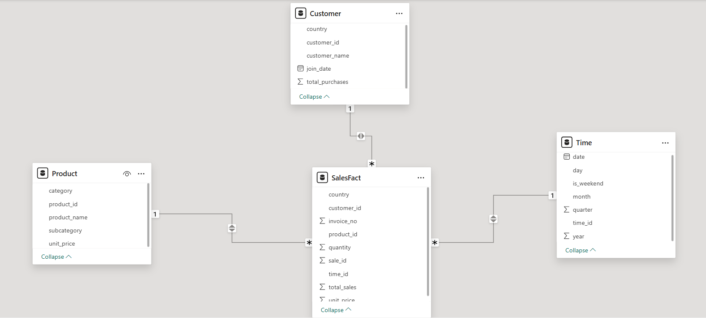

- SQL: **dw_schema.sql**.  
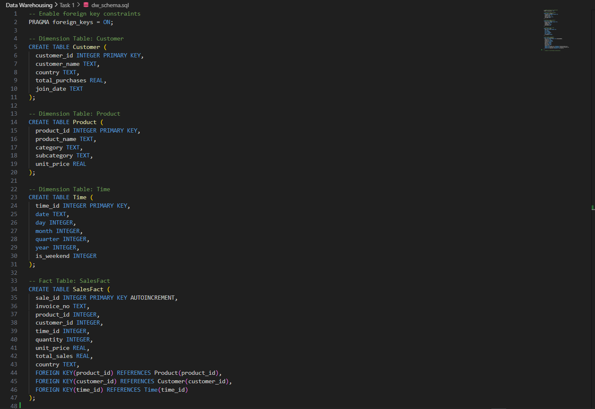


### Task 2: ETL Process  
- **Dataset:** Online Retail dataset (UCI).  
- Steps:
  1. Extracted CSV into pandas DataFrame.
  2. Transformed:
     - Added `TotalSales` column.
     - Filtered invalid data (Quantity < 0, UnitPrice <= 0).
     - Created summaries and dimension tables.
  3. Loaded into SQLite database (**retail_dw.db**) with:
     - SalesFact
     - Customer
     - Time
     - Product
- ETL implemented in **etl_retail.ipynb**.
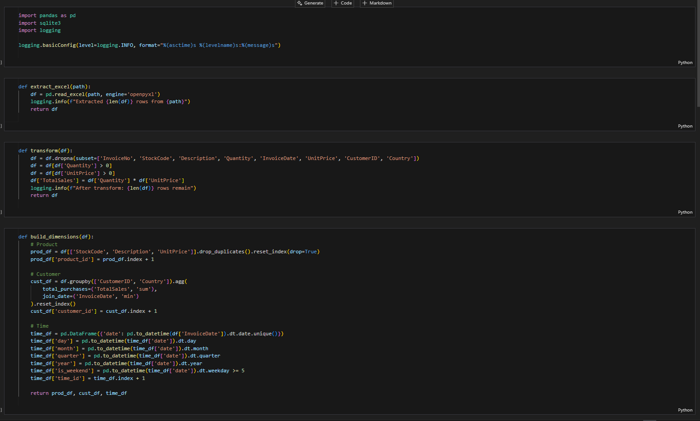
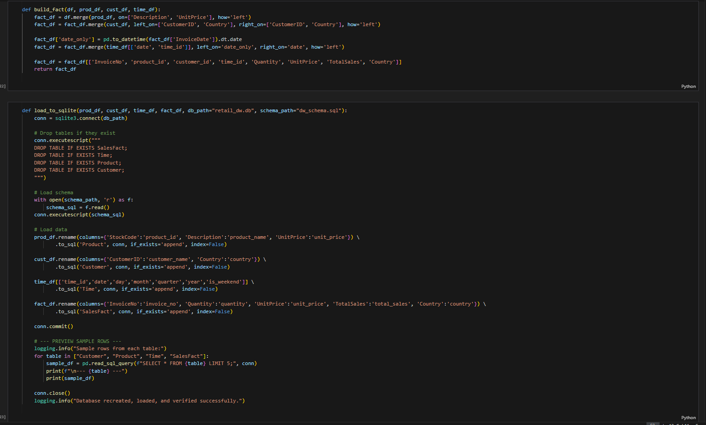
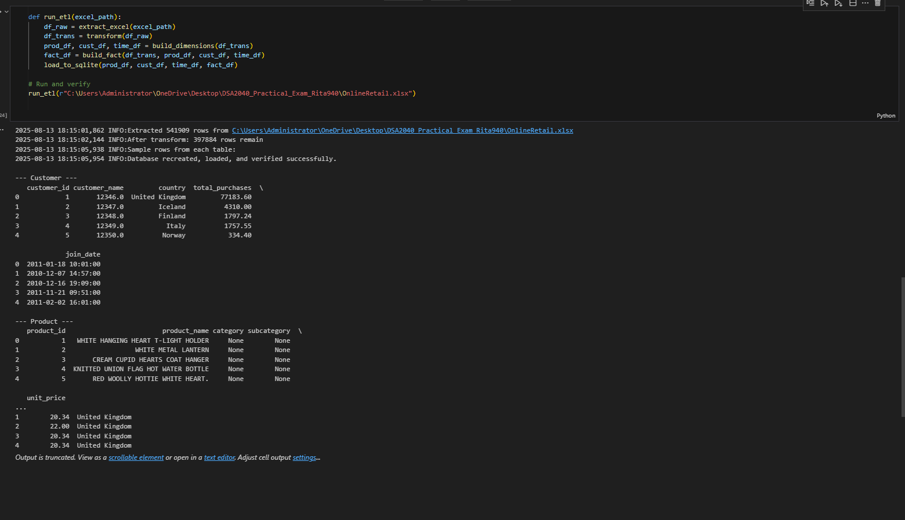


### Task 3: OLAP Queries & Visualization  
- Queries in **olap_queries.sql**:
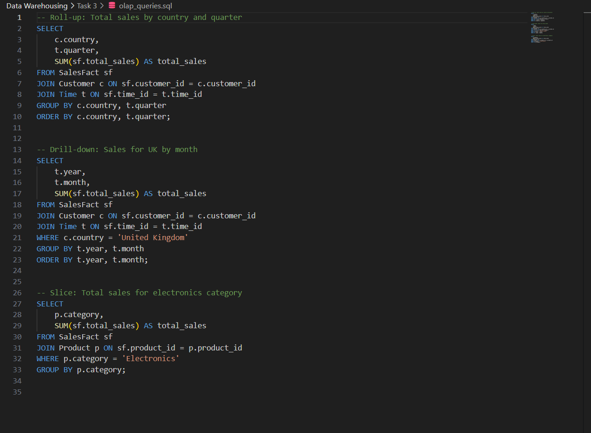
 
 - Roll-up: Sales by country & quarter.
 - Drill-down: Monthly sales for a selected country.
 - Slice: Sales for electronics category.

- Visualizations:
  - Top 10 countries by sales.


  - Bottom 10 countries by sales.
  

  - Total sales by country.


- Analysis in **olap_analysis.pdf**.


## Section 2: Data Mining  

### Task 1: Data Preprocessing & Exploration  
- **Dataset:** Iris dataset (scikit-learn built-in).  
- Steps:
  - Handled missing values.
  - Applied Min-Max normalization.
  - Encoded class labels for modeling.
  - Generated:
    - Boxplots for outlier detection.
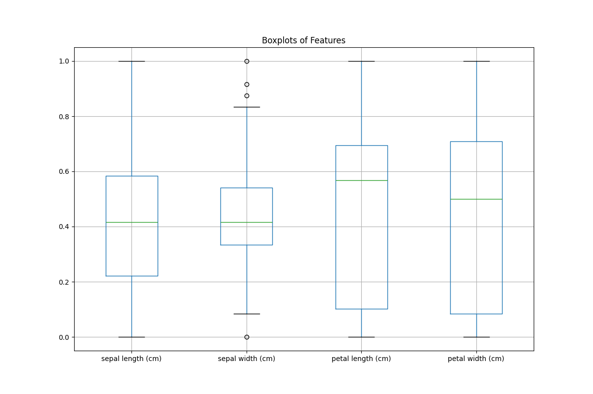

  - Correlation heatmap.
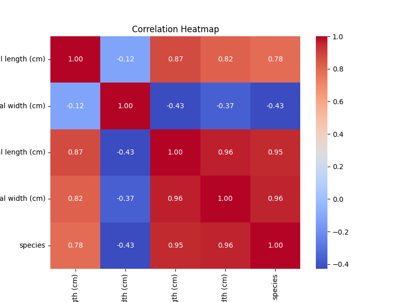 

  - Pairplot for feature relationships.


  - Split into 80% training and 20% testing sets.


### Task 2: Clustering  
- **Method:** K-Means (k=3, k=2, k=4 for comparison).  
- Metrics: Adjusted Rand Index (ARI).  
- Outputs:
  - Elbow curve for k selection.
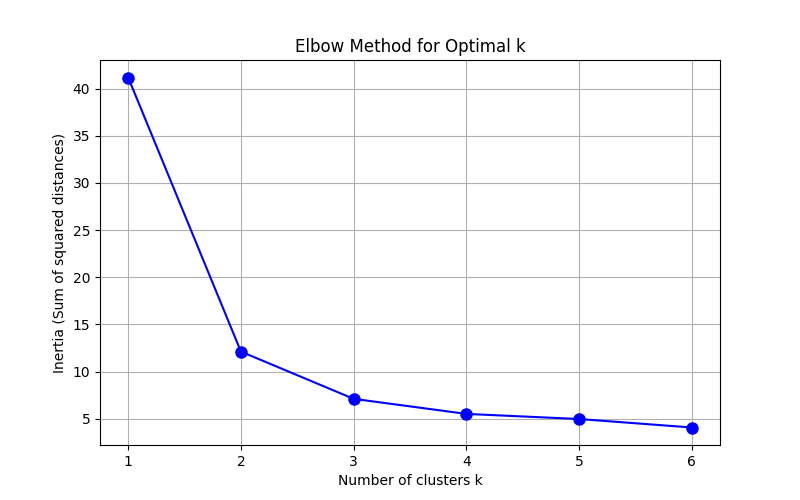

  - Scatter plot of clusters.
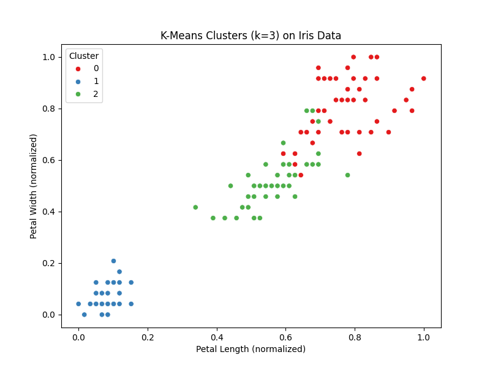

- Analysis included in **clustering_analysis.pdf**.


### Task 3: Classification & Association Rule Mining  
**Classification**  
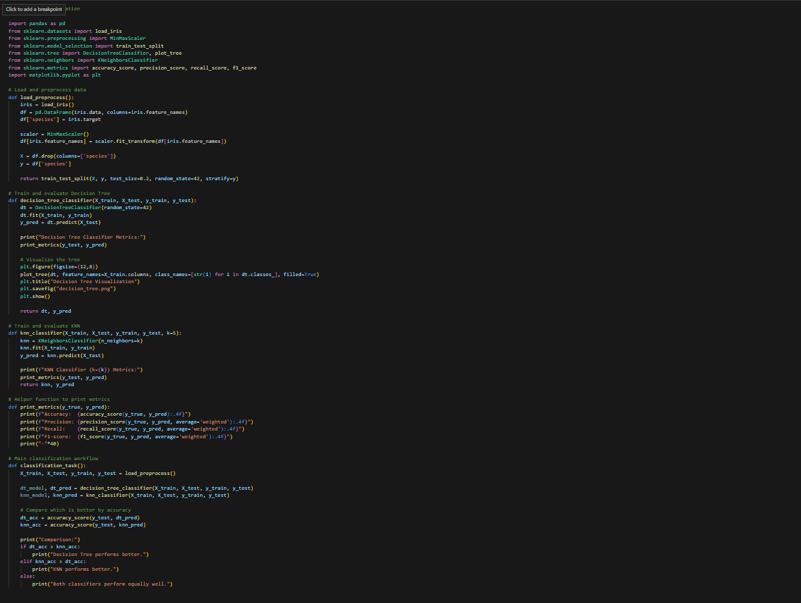

- Models: Decision Tree (visualized) and K-Nearest Neighbors (K=5). 
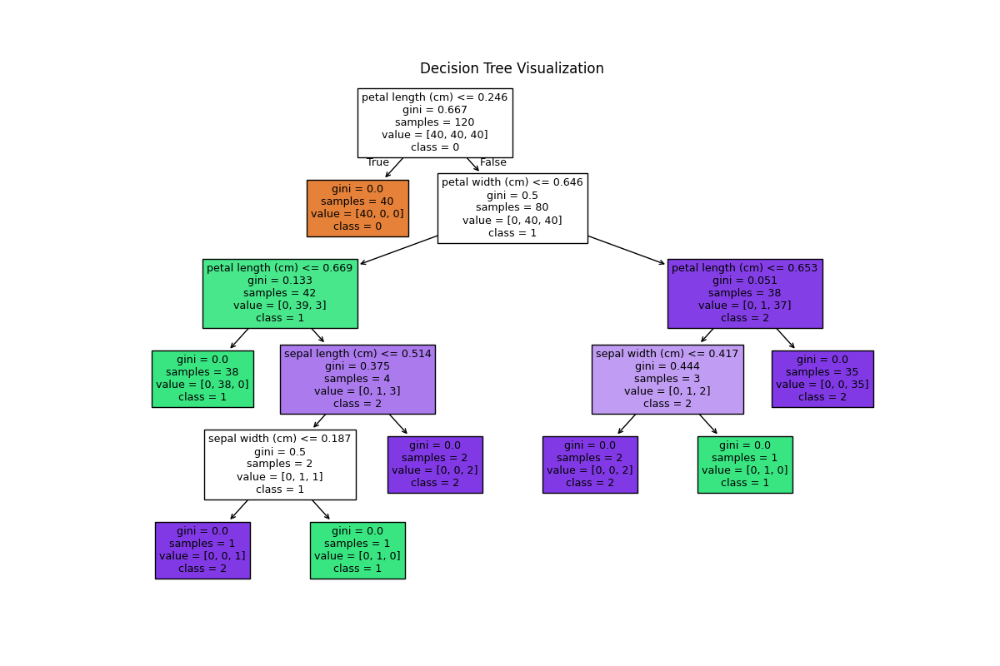 

- Evaluated using accuracy, precision, recall, and F1-score.  
- Compared performance between models.  

**Association Rule Mining**  
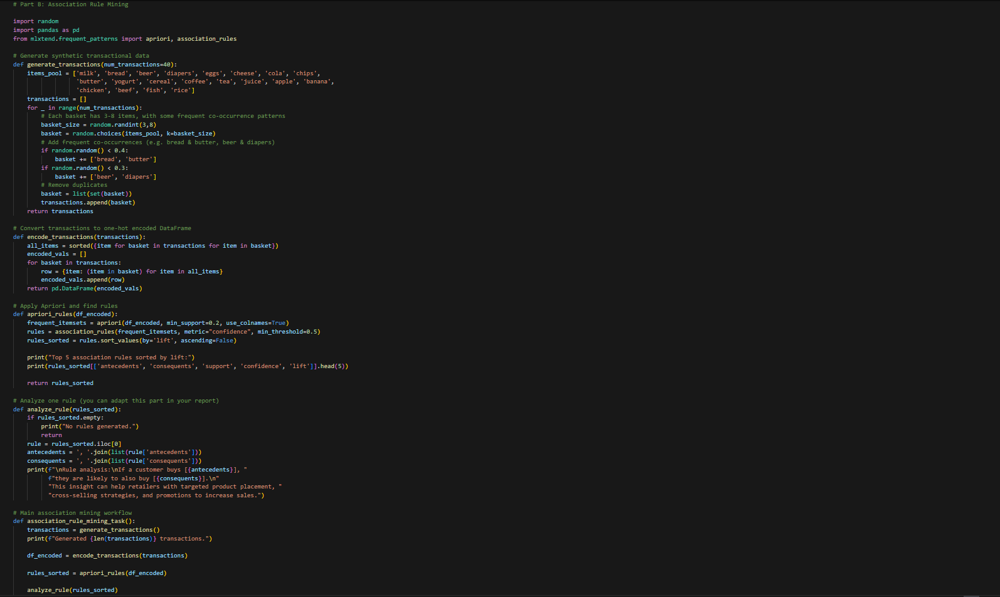

- Generated synthetic transactions (~30 baskets, 20 possible items).  
- Applied Apriori algorithm (min_support=0.2, min_confidence=0.5).  
- Extracted top 5 rules by lift.  
- Business implications discussed in the PDF report.

## Conclusion

This project delivers an end-to-end data analytics solution covering data warehousing, ETL, OLAP and data mining techniques like clustering, classification and association rule mining. It demonstrates the ability to design robust data pipelines, perform advanced analysis and create visual insights that support decision-making.

